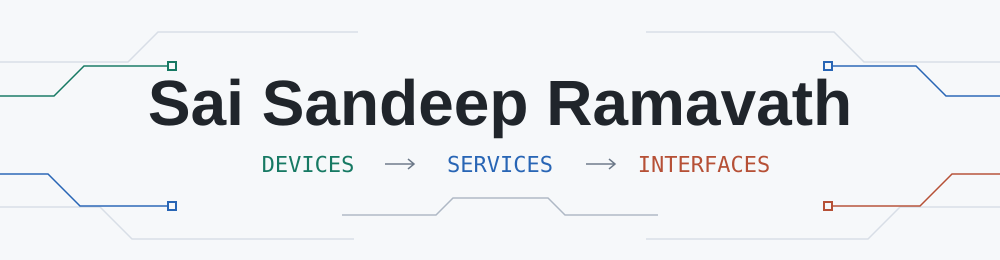
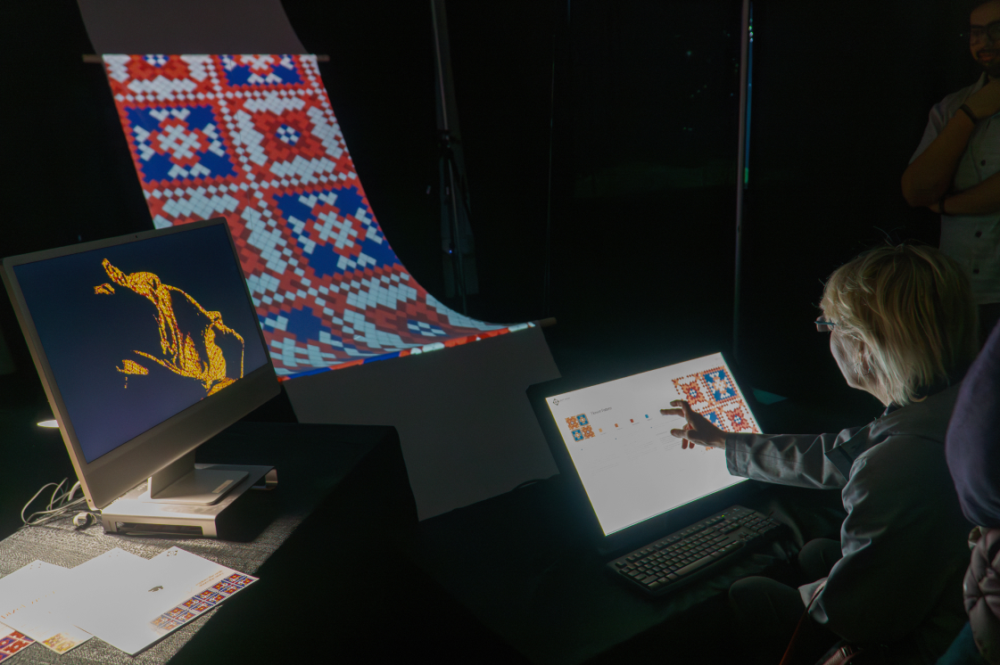

<picture>
  <source media="(prefers-color-scheme: dark)" srcset="assets/cover-dark.svg">
  <source media="(prefers-color-scheme: light)" srcset="assets/cover-light.svg">
  
</picture>

  <a href="https://rsaisandeep.com">Portfolio</a> &nbsp; / &nbsp;
  <a href="https://www.linkedin.com/in/saisandeepramavath/">LinkedIn</a> &nbsp; / &nbsp;
  <a href="mailto:saisandeepramavath@gmail.com">Email</a>

**I build the software between a device and the person using it.**

I'm a full-stack software engineer drawn to connected systems: an MQTT message leaving a device, the service that makes sense of it, and the interface that makes it useful. My work spans edge gateways, backend APIs, real-time data, and web and mobile apps.

> **Open to new positions and ready to relocate.** Currently based in Rochester, NY.

## Beyond the browser

### Pixel Weave

Code can become something you walk up to and interact with. I helped bring **Janki Akbari's** textile installation to life through website development and real-time synchronization across its two-screen experience, exhibited at Imagine RIT.

[Explore the case study](https://jankiakbari.design/pixel-weave) · [Try the interactive experience](https://janakiakbari.netlify.app)

Design: Janki Akbari. Exhibition photography: Jatin Joshi.

## A few repositories to explore

### [MSN / Bill Splitter](https://github.com/saisandeepramavath/SWEN732PROJ)

A team-built app for the surprisingly complicated business of sharing expenses. Groups, custom splits, offline entries, and real-time sync.

`React Native` `Expo` `Firebase` `Jest`

### [Lane Change / Heartbeat Monitor](https://github.com/saisandeepramavath/LaneChangeDecision)

A Java simulation that asks: **how do you know a component has stopped behaving?** TCP heartbeats, health monitoring, fault injection, and fallback handling.

`Java` `TCP sockets` `Fault simulation`

### [Weather App](https://github.com/saisandeepramavath/WeatherApp)

A small React app with a clear job: turn your location into the current weather. Browser geolocation, an API, and a focused interface. [Open the live demo](https://saisandeepramavath.github.io/WeatherApp/).

`React` `OpenWeatherMap` `React Bootstrap`

## Tools I reach for

   &nbsp;
   &nbsp;
   &nbsp;
   &nbsp;
   &nbsp;
   &nbsp;
   &nbsp;
   &nbsp;
   &nbsp;
  

Python, Go, and TypeScript are recurring choices. FastAPI and React for applications; PostgreSQL for data; Docker, Terraform, and MQTT when the work crosses services and devices.

  
A little more of the toolbox

- **Applications:** Django, React Native, ASP.NET MVC, SQLAlchemy, Pydantic
- **Data and visibility:** TimescaleDB, SQLite, Firebase, Grafana, Datadog, Wireshark
- **At the edge:** Raspberry Pi, ESP32, MicroPython, Node-RED, BLE
- **Delivery and testing:** Jenkins, GitHub Actions, Jest, pytest

---

I like tracing problems end to end, making failures easier to understand, and turning repetitive work into software.
